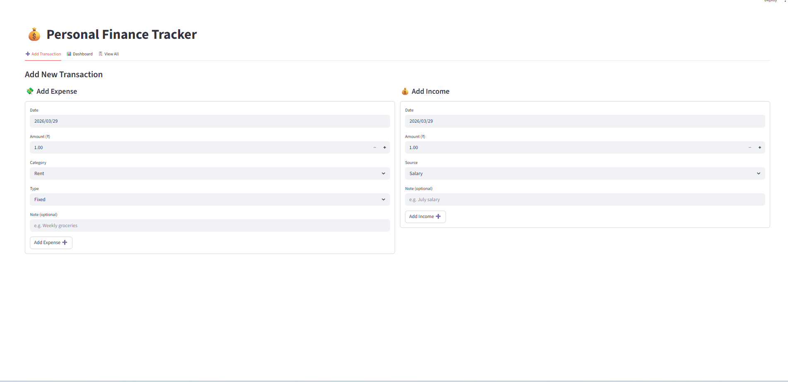
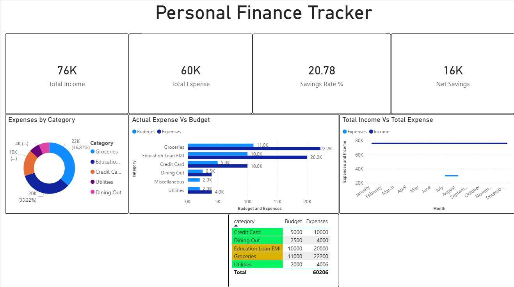

# 💰 Personal Finance Tracker

A full-stack personal finance management tool built with **Python**, **Streamlit**, and **Power BI** — designed to help individuals track income, expenses, savings, and budget adherence with interactive visualizations and real-time insights.

---

## 🔴 Live Demo
> Run locally using the steps below — or deploy free on [Streamlit Cloud](https://personal-finance-tracker-ewzo.onrender.com/)

---

## 📌 Project Overview

This project simulates a real-world personal finance dashboard used by individuals to:
- Log daily income and expenses via an interactive form
- Monitor monthly budget limits vs actual spending
- Track savings rate and net savings month over month
- Visualise spending patterns through interactive Plotly charts
- Analyse budget health with a color-coded Power BI dashboard

---

## 🛠️ Tech Stack

| Layer | Technology |
|---|---|
| Data processing | Python 3, Pandas |
| Web application | Streamlit |
| Charts | Plotly Express |
| BI Dashboard | Power BI Desktop |
| Storage | CSV (easily replaceable with SQLite) |
| Version control | Git & GitHub |

---

## 📁 Project Structure

```
personal-finance-tracker/
│
├── data/
│   ├── expenses.csv        # Expense transaction records
│   ├── income.csv          # Income records
│   └── budget.csv          # Monthly budget limits per category
│
├── src/
│   ├── Expenses.py         # Expense analytics module
│   ├── income.py           # Income analytics module
│   └── budget.py           # Budget vs actual comparison module
│
├── dashboard/
│   └── Personal_Finance_Dashboard.pbix   # Power BI dashboard
│
├── app.py                  # Streamlit web application
├── requirements.txt        # Python dependencies
└── README.md
```

---

## ⚙️ Features

### 1. Add Transactions (Form-based input)
- Add expenses with date, amount, category, type and notes
- Add income with source (Salary, Freelance, Dividend, etc.)
- Input validation on all fields

### 2. Dashboard
- **KPI Cards** — Total Income, Total Expenses, Net Savings, Savings Rate %
- **Donut Chart** — Expense breakdown by category
- **Bar Chart** — Spending by type (Fixed / Variable / Discretionary)
- **Budget vs Actual** — Side-by-side comparison with overspend flagging
- **Monthly Trend** — Income vs Expenses line chart over time
- **Month selector** — Filter all visuals by month

### 3. View & Filter Transactions
- Filter expenses by category and type
- View full income and expense history in sortable tables

### 4. Power BI Dashboard
- Interactive KPI cards with DAX measures
- Color-coded budget status table (🟢 On Track / 🟡 Warning / 🔴 Over Budget)
- Clustered bar chart — Budget vs Actual by category
- Month slicer to filter all visuals simultaneously

---

## 📊 Expense Categories

| Type | Categories |
|---|---|
| Fixed | Rent, EMI, Subscriptions, Utilities |
| Variable | Groceries, Transport, Healthcare, Education |
| Discretionary | Dining Out, Shopping, Entertainment |

---

## 🚀 Getting Started

### Prerequisites
- Python 3.8+
- pip or virtual environment

### Installation

```bash
# Clone the repository
git clone https://github.com/chandantiwariyt/Personal-Finance-Tracker.git
cd personal-finance-tracker

# Create and activate virtual environment
python -m venv .venv
.venv\Scripts\activate        # Windows
source .venv/bin/activate     # Mac/Linux

# Install dependencies
pip install -r requirements.txt

# Run the app
streamlit run app.py
```

### Sample Data
The `data/` folder contains sample data for July 2024 covering:
- 1 month of salary and freelance income
- 30+ expense transactions across 6 categories
- Budget limits for all categories

---

## 📈 Key Metrics (Sample Data)

| Metric | Value |
|---|---|
| Monthly Income | ₹76,000 |
| Monthly Expenses | ₹30,103 |
| Net Savings | ₹46,000 |
| Savings Rate | 20.8% |
| Categories Tracked | 6 |
| Over Budget | Groceries (+₹100) |

---

## 📷 Screenshots

### Streamlit Web App
>

### Power BI Dashboard
> 

---

## 📝 Requirements

```
pandas
streamlit
plotly
openpyxl
```

Install all with:
```bash
pip install -r requirements.txt
```

---

## 🔮 Future Improvements
- [ ] Connect to SQLite database instead of CSV
- [ ] Add user authentication
- [ ] Email alerts when budget is exceeded
- [ ] Investment portfolio tracker with live stock prices
- [ ] Export monthly PDF report automatically
- [ ] Deploy on Streamlit Cloud with public URL

---

## 👤 Author
Built by **Chandan Tiwari** — [LinkedIn](https://www.linkedin.com/in/chandantiwari4/) · [GitHub](https://github.com/chandantiwariyt)
---

## 📄 License
This project is open source and available under the [MIT License](LICENSE).
